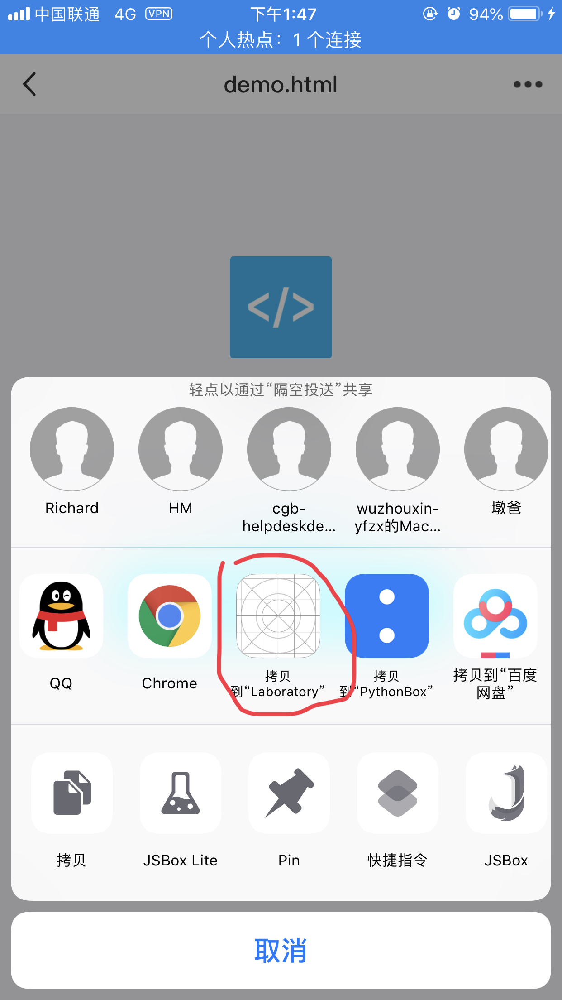

# File App

> **iOS11**苹果提供了`Files` app, 可以存储可供其他app访问的文件.

## 从其他app拷贝文件到自己的app

    实现以下功能
    

    1. 只需在info.plist中添加下面的内容, 就可以将其他app的文件拷贝到自己的app中(用其他应用打开, 选择拷贝到xxx app).
    
    

    2. 点击“拷贝到xxx”后，将跳转到自己项目中。需要在自己项目的AppDelegate.m文件中处理回调.
    
    ```objective-c
    - (BOOL)application:(UIApplication *)app openURL:(NSURL *)url options:(NSDictionary<UIApplicationOpenURLOptionsKey,id> *)options
    {
        if ([url.absoluteString hasPrefix:@"file:///private/"]) {
            NSString *fileName = [url.absoluteString lastPathComponent];
            NSData *data = [NSData dataWithContentsOfURL:url];
            // handle data
        }
        return YES;
    }
    ```
    
    ## Files(文件)app中显示本app沙盒文件目录
        
        * 在info.plist中添加key`Supports Document Browser`, value为`YES`即可. 并且可以从其他app中保存文件至本app的沙盒目录中(`我的iPhone`中app对应文件夹).
        * 对于本地文件, 可以通过`UIDocumentPickerViewController`类进行管理.
